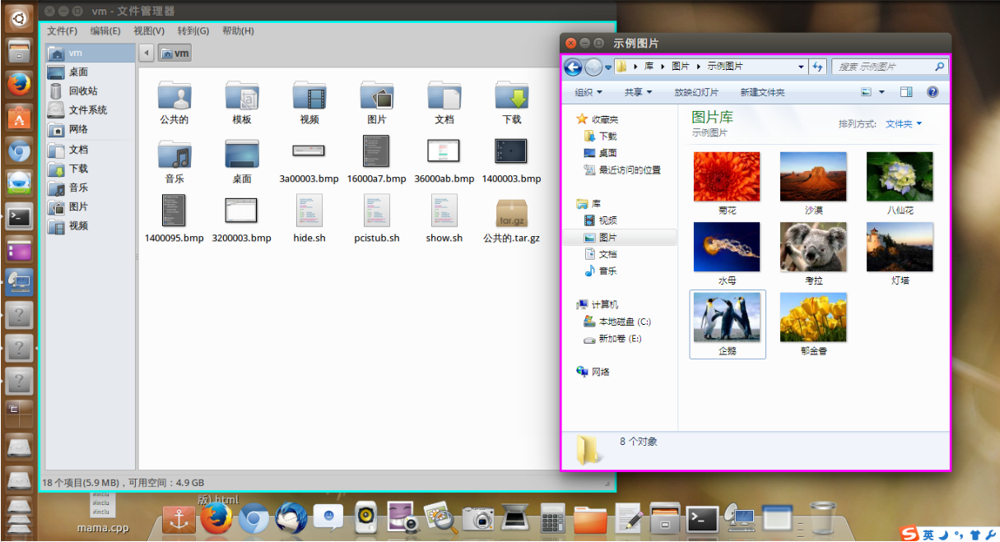

# neo

Last update: 2017/1/11 9:00:00

neo OS 是一款部署在PC上的安全架构。

# 设计说明
1. 假设应用不可信。所有应用程序均运行在虚拟机中，Host 只运行 vmOS 组件。
2. 实行强制访问控制。对应用分级，对层级间的信息流严格监视。
3. 最小化网络攻击威胁。所有虚拟机通过某台虚拟网络设备与外界通信。
4. 提供虚拟机间通信机制，如剪贴板，方便应用程序间通信。
5. 一体桌面体验。虚拟机对用户不可见。
6. 提供安全、高效（轻量级）的客户平台。

# 实现说明
目前neo OS运行在Linux宿主系统上（内核版本要求2.0以上）。支持Windows和Linux的应用。
未来将支持Windows宿主系统。

# 硬件要求
x86-64平台，CPU支持Intel-VT。

# 具体说明
1. 安装一个新的程序：
	网络：指定安全等级，下载安装程序或源代码。应用安装在对应虚拟机中。
	存储：指定安全等级，由对应虚拟机挂载设备并安装。(TODO)
2. 创建新虚拟机：
	提供镜像模板。同一类型系统共享一个内核镜像。每台虚拟机拥有独立数据镜像。
3. 安装新系统：
	联系提供方。下载对应系统镜像。

[vmOS: A virtualization-based, secure desktop system](https://doi.org/10.1016/j.cose.2016.10.008)

AUTHOR: Maxul Lee (lmy2010lmy@gmail.com)
